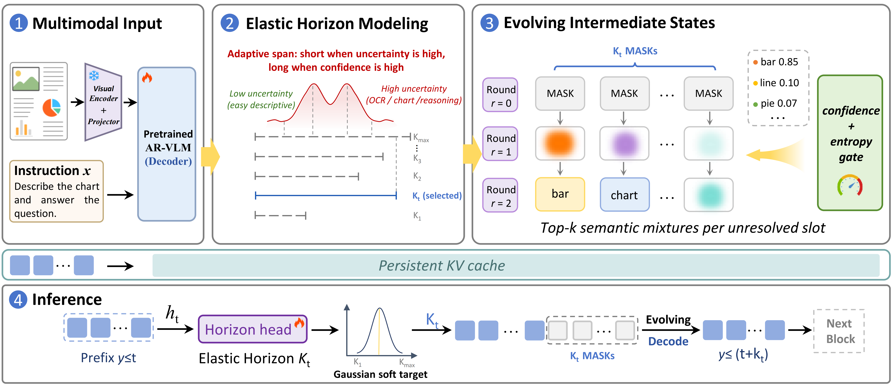

# FLUID-V: Efficient Diffusion Adaptation for Vision-Language Models

[](https://github.com/hiyouga/LLaMA-Factory)
[](#model-weights)
[](#license)

This repository contains the official implementation of **FLUID-V**, a vision-language extension of **FLUID (Flexible Unidirectional Inference Diffusion)**. FLUID-V adapts an autoregressive vision-language backbone into an efficient strictly causal diffusion-style generator with elastic generation horizons.

The current release provides the training and inference code used for the OpenPangu-VL FLUID-V model family, together with a lightweight LLaMA-Factory integration for reproducible supervised fine-tuning.



## Highlights

- **Strictly causal diffusion**: Preserves the causal inductive bias of autoregressive backbones while enabling block-wise denoising and parallel token restoration.
- **Elastic horizon decoding**: Uses a dynamic generation horizon to expand through confident regions and contract around high-entropy visual-language reasoning steps.
- **Vision-language training path**: Supports OpenPangu-VL adaptation with multimodal examples, image token handling, LoRA training, and optional dynamic-K head calibration.
- **LLaMA-Factory integration**: Keeps the training workflow close to standard LLaMA-Factory usage while adding the FLUID-V model wrapper and data arguments.

## Repository Layout

```text
FLUID-V/
|-- assets/                     # Figures and README assets
|-- config/                     # FLUID-V training configs
|   |-- deepspeed/              # DeepSpeed configs
|   |-- train_openpangu_vl_nothink_lora.yaml
|   `-- train_openpangu_vl_nothink_head.yaml
|-- llamafactory/               # LLaMA-Factory source with FLUID-V loader support
|-- model/                      # FLUID-V wrappers and inference code
|   |-- __init__.py             # LLaMA-Factory wrapper factory
|   |-- infer.py                # Single-prompt inference entrypoint
|   |-- model_vl_nothink_v6.py
|   `-- model_nothink_v6_head.py
`-- scripts/                    # Training and inference launch helpers
```

Large checkpoints, datasets, cached preprocessing files, logs, evaluation outputs, and visualization traces are not included in this source tree.

## Installation

Create or activate a Python environment with PyTorch, Transformers, and the common vision-language dependencies installed, then install the bundled LLaMA-Factory package in editable mode.

```bash
cd FLUID-V
pip install -r llamafactory/requirements.txt
pip install -e llamafactory
```

If your environment requires a specific Python executable, pass it through `FLUIDV_PYTHON` when using the provided scripts.

```bash
export FLUIDV_PYTHON=/path/to/python
```

## Model Weights

Model checkpoints will be released separately. The following placeholder can be updated after the public weight upload is finalized.

| Model | Base Model | Components | Link |
| --- | --- | --- | --- |
| FLUID-V-OpenPanguVL-7B | FreedomIntelligence/openPangu-VL-7B | Stage-1 LoRA + Stage-2 dynamic-K head | TODO |

For local experiments, place checkpoints under `saves/` or update the paths in the config files directly.

## Dataset

Training data will be released separately. The LLaMA-Factory dataset registry is provided at `llamafactory/data/dataset_info.json`; put the released files under the relative paths declared there.

Expected layout:

```text
llamafactory/data/distill_data/
|-- ctrl/distilled_openpangu_vl.jsonl
|-- infinity/distilled_openpangu_vl.jsonl
|-- moss/distilled_openpangu_vl.jsonl
|-- ultrachat/distilled_openpangu_vl.jsonl
|-- llavanext/distilled_openpangu_vl.jsonl
`-- eval_merge/merged_sharegpt.clean.jsonl
```

Dataset entries use the ShareGPT-style conversation format. Image-bearing subsets should provide image paths through the `images` field, relative to `media_dir` unless absolute paths are used.

## Training

FLUID-V uses a two-stage training recipe.

### Stage 1: FLUID-V LoRA Adaptation

Stage 1 adapts the OpenPangu-VL backbone with the FLUID-V strictly causal diffusion objective.

```bash
scripts/train_stage1_lora.sh
```

Main config: `config/train_openpangu_vl_nothink_lora.yaml`

### Stage 2: Dynamic-K Head Calibration

Stage 2 loads the stage-1 adapter, freezes the teacher path, and trains the lightweight dynamic-K head for elastic horizon prediction.

```bash
scripts/train_stage2_head.sh
```

Main config: `config/train_openpangu_vl_nothink_head.yaml`

By default, the launch scripts set `PYTHONPATH`, `FORCE_TORCHRUN=1`, and `NPROC_PER_NODE=1`. Override `NPROC_PER_NODE` and `CUDA_VISIBLE_DEVICES` for multi-GPU runs.

## Inference

Run single-prompt inference with optional image inputs:

```bash
scripts/infer.sh \
  --base-model-path FreedomIntelligence/openPangu-VL-7B \
  --adapter-path saves/openpangu_vl_nothink/v6/checkpoint-32000 \
  --image examples/demo.jpg \
  --prompt "Describe the image."
```

To use a stage-2 dynamic-K head checkpoint, add `--head-checkpoint-path`:

```bash
scripts/infer.sh \
  --base-model-path FreedomIntelligence/openPangu-VL-7B \
  --adapter-path saves/openpangu_vl_nothink/v6/checkpoint-32000 \
  --head-checkpoint-path saves/openpangu_vl_nothink/v6_head/checkpoint-2000 \
  --image examples/demo.jpg \
  --prompt "Describe the image."
```

Useful decoding arguments include `--k-masks`, `--max-new-tokens`, `--block-size`, `--confidence-threshold`, and `--attn-implementation`.

## Implementation Notes

- `model/model_vl_nothink_v6.py` implements the main FLUID-V wrapper.
- `model/model_nothink_v6_head.py` implements the dynamic-K head training and inference utilities.
- `llamafactory/src/llamafactory/model/loader.py` imports `model.get_md_model` when `IS_MDModel: true` is set in the YAML config.
- `llamafactory/src/llamafactory/data/processor/supervised.py` supports FLUID-V bucketed effective-K training through `md_bucket_cutoffs` and `md_bucket_k_masks`.

## Acknowledgements

FLUID-V builds on OpenPangu-VL and LLaMA-Factory. We thank the openPangu and LLaMA-Factory teams for releasing the models and training infrastructure that make this work possible.

OpenPangu is a trademark of Huawei Technologies Co., Ltd. Please refer to the original OpenPangu resources and license files for details.

## License

The final project license should be added before public release. The bundled LLaMA-Factory code retains its original license under `llamafactory/LICENSE`.

## Citation

If you find FLUID-V useful for your research, please cite the project. The citation entry below is a placeholder and should be updated after the paper metadata is finalized.

```bibtex
@misc{fluidv2026,
  title        = {FLUID-V: Efficient Diffusion Adaptation for Vision-Language Models},
  author       = {FLUID-V Team},
  year         = {2026},
  howpublished = {\url{https://github.com/your-org/FLUID-V}}
}
```
